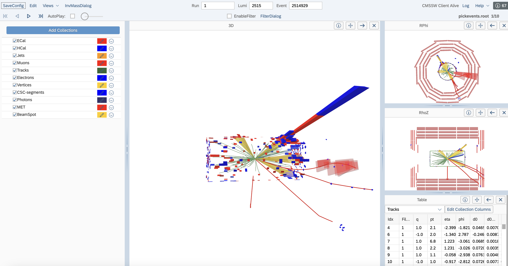

In this episode you will create event display of signal simulation events that pass the signal region selectionns

## Find and pick events you want to view

We will first find the events that we want to view, by saving the run number, lumi section, and event number of the events in a text file.

> ## Open a notebook
>
> For this part, open the notebook called `event_display.ipynb`.
> This note book is very similar to the notebook in the previous episode, where we make the signal region selection.
> In addition, we save the run number, lumi section, and event number of the events that we want to view in a text file.
{: .checklist}

Now run the following code that will pick the ROOT files in the dataset that contain the events that you want based on the run/lumi/event numbers that you supplied:

~~~
edmPickEvents.py  "/ggH_HToSSTobbbb_MH-125_TuneCP5_13TeV-powheg-pythia8/RunIIFall17DRPremix-PU2017_rp_94X_mc2017_realistic_v11-v1/GEN-SIM-RECO” event_display.txt
~~~
{: .language-bash}

The above command will print another command on the screen, like the following, copy and run it in the terminal:

~~~
edmCopyPickMerge outputFile=pickevents.root \
  eventsToProcess=1:10122482,1:1055072,1:1055666,1:1127224,1:12138657,1:1441939,1:1441963,1:2514929,1:2896338,1:4255433 \
  inputFiles=/store/mc/RunIIFall17DRPremix/ggH_HToSSTobbbb_MH-125_TuneCP5_13TeV-powheg-pythia8/GEN-SIM-RECO/PU2017_rp_94X_mc2017_realistic_v11-v1/130001/B2A708EC-0D4E-EA11-8B93-0025905C2CBC.root,/store/mc/RunIIFall17DRPremix/ggH_HToSSTobbbb_MH-125_TuneCP5_13TeV-powheg-pythia8/GEN-SIM-RECO/PU2017_rp_94X_mc2017_realistic_v11-v1/130001/84696409-FC4D-EA11-A8CD-0CC47AFF0190.root,/store/mc/RunIIFall17DRPremix/ggH_HToSSTobbbb_MH-125_TuneCP5_13TeV-powheg-pythia8/GEN-SIM-RECO/PU2017_rp_94X_mc2017_realistic_v11-v1/130000/349A8AB2-BF4D-EA11-9AFF-00259073E43C.root,/store/mc/RunIIFall17DRPremix/ggH_HToSSTobbbb_MH-125_TuneCP5_13TeV-powheg-pythia8/GEN-SIM-RECO/PU2017_rp_94X_mc2017_realistic_v11-v1/130001/A4F52ADD-C94D-EA11-B339-7CD30AD091F0.root,/store/mc/RunIIFall17DRPremix/ggH_HToSSTobbbb_MH-125_TuneCP5_13TeV-powheg-pythia8/GEN-SIM-RECO/PU2017_rp_94X_mc2017_realistic_v11-v1/130000/04DB0102-BB4D-EA11-A197-7CD30AD0A78C.root,/store/mc/RunIIFall17DRPremix/ggH_HToSSTobbbb_MH-125_TuneCP5_13TeV-powheg-pythia8/GEN-SIM-RECO/PU2017_rp_94X_mc2017_realistic_v11-v1/130000/D6C63C14-484C-EA11-B04A-1866DA85DC8B.root,/store/mc/RunIIFall17DRPremix/ggH_HToSSTobbbb_MH-125_TuneCP5_13TeV-powheg-pythia8/GEN-SIM-RECO/PU2017_rp_94X_mc2017_realistic_v11-v1/130001/4A6C137D-CA4D-EA11-B475-001E67E7195C.root,/store/mc/RunIIFall17DRPremix/ggH_HToSSTobbbb_MH-125_TuneCP5_13TeV-powheg-pythia8/GEN-SIM-RECO/PU2017_rp_94X_mc2017_realistic_v11-v1/130001/DAD03CA8-624E-EA11-A67F-0242AC1C0504.root
 ~~~
 {: .language-bash}

Depending on how many events you've chosen, the process might long, don't choose more than 10 events!
Now you have a ROOT file called `pickevents.root` that contains the RECO format of the events you have chosen.

cmsShow is the program used to view event displays. cmsShow is now used with a web-based GUI. Before using the GUI, you need to copy your picked events file to cernbox.

Create a new directory in your personal [cernbox](https://cernbox.cern.ch). You will need to add viewer access to cms-vis-access
> ## CernBox
> 
>
{: .callout}
## Open the events with cmsShow

Once the file is in cernbox and you have given cms-vis-access viewer permission, you can view the event by going to [cmsShow](https://fireworks.cern.ch)

You will now see a graphical interface like this:
> ## Figure 5.1
> 
> Event display of a signal event from cmsShow.
{: .callout}

By default the `csc2DRecHits` are not included in the display, go to Add Collectionon the left to add the rechits collections!
Now you can skim through the events that you have selected to see if the clusters appear as you've expected.



