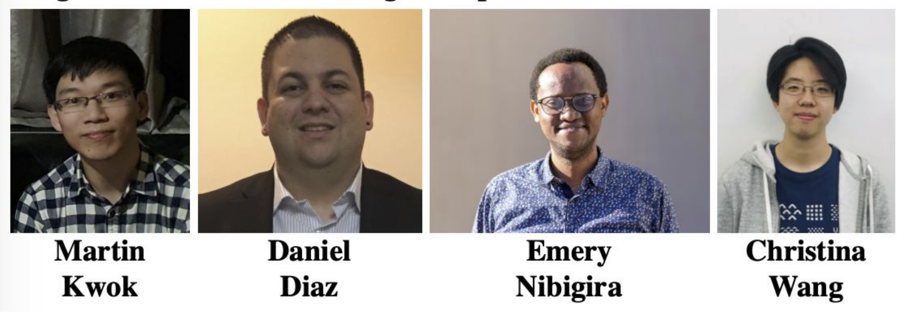

<!-- this is an html comment -->

 This is a comment in Liquid 

> ## Links
> * [CMSDAS at LPC2025](https://indico.cern.ch/event/1462056/)
> * [Github repo](https://github.com/kakwok/MDS_CMSDAS/tree/2025)
> * [Paper reference](https://cms-results.web.cern.ch/cms-results/public-results/publications/EXO-20-015/index.html)
> * [EXO-20-015 CADI page](https://cms.cern.ch/iCMS/analysisadmin/cadilines?id=2391&ancode=EXO-20-015&tp=an&line=EXO-20-015)
{: .callout}

> ## Prerequisites
>
> * [CMS DAS Pre-exercises](https://fnallpc.github.io/cms-das-pre-exercises/) 
> * [CMS DAS offline ROOT short exercise](https://cmsdas.github.io/root-short-exercise/)
> * [CMS Statistics short exercise](https://fnallpc.github.io/statistics-das/)
> * [CMS Pile-Up and Missing ET short exercise](https://garvitaa.github.io/METDAS/)
> * [CMS DAS offline event display short exercise](https://fnallpc.github.io/statistics-das/index.html)
{: .prereq}

### Goal of this exercise

This exercise will search for long-lived particles decaying in the CMS muon detector, where we use the muon detector as a sampling calrimeter to identify displaced showers produced by decays of LLPs. 

The signature is enabled by the unique design of CMS muon detectors, composed of detector planes interleaved with the steel layers of the magnet flux-return yoke. Decays of LLPs in the EMD induce hadronic and electromagnetic showers, giving rise to a high hit multiplicity in localized detector regions that can be efficiently identified with a novel reconstruction technique. The steel flux-return yoke in the CMS detector also provides exceptional shielding from the SM background that dominates existing LLP searches. 

The exercise is based on [CMS-EXO-20-015](https://cms-results.web.cern.ch/cms-results/public-results/publications/EXO-20-015/index.html), which is the first paper to use this innovative LLP reconstruction technique to search for high-multiplicity muon detector showers(MDS).

The exercise is performed on data collected during Run 2. 

Students will perform the full analysis to search for LLPs decaying in the endcap muon detectors:
 * learn general feature of long-lived particles
 * study the reconstruction of muon detector shower;
 * optimize the event selection;
 * estimate background yield with the ABCD method;
 * perform statistical analysis on the results
 * make event displays of signal simulation events

### Facilitators CMSDAS LPC 2025

 * Martin Kwok (FNAL)
 * Christina Wang (FNAL)
 * Daniel Diaz (UCSD)
 * Emery Nibigira (Tennessee)	 

### Introductory slides

We will start with this introductory slides: [CMSDAS_2025.pdf](https://indico.cern.ch/event/1462056/contributions/6313496/attachments/2996184/5278686/CMSDAS_2025.pdf).

### Support

Join the [LongEX LLP Mattermost channel](https://mattermost.web.cern.ch/cmsdaslpc2025/channels/longexmds) and don't hesitate to ask for help from the facilitators in the room.


